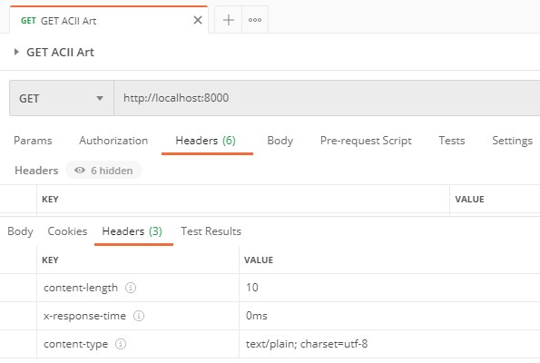
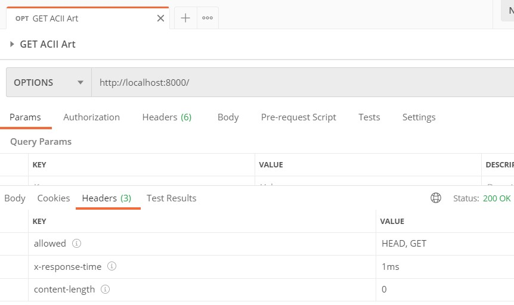

# Deno | The NASA Project

A full stack app written in **Deno** and **Oak**.

Deployed in **Heroku** with Buildpacks. Frontend: https://deno-nasa.herokuapp.com/index.html

- Current libraries/frameworks available for _Deno_:

  - **Oak** is a middleware framework for Deno's http server, including a router middleware. https://github.com/oakserver/oak
  - **Drash** is a REST micro-framework for Deno's HTTP server with zero dependencies.
    - https://drash.land/
    - https://drash.land/drash
  - **Deno Express** is a Deno Webserver like the node express way. https://github.com/NMathar/deno-express
  - **Pogo** is an easy-to-use, safe, and expressive framework for writing web servers and applications. It is inspired by hapi. https://github.com/sholladay/pogo
  - **Servest** is a http module suite for Deno:
    - https://servestjs.org/
    - https://github.com/keroxp/servest

- **Oak Basics**:

  - Current version: https://deno.land/x/oak@v6.3.0/mod.ts
  - Oak Documentation: https://doc.deno.land/https/deno.land/x/oak@v6.3.0/mod.ts
  - Example Context Response Headers (Middleware):
    
  - NOTE: Challenges Page found (although no new challenges out since 2019): https://adventofcode.com/2019/about
  - **allowedMethods()** allows other machines to know what routes our app supports and to get specific status codes back from the requests.
    ```typescript
    app.use(api.allowedMethods());
    ```
    - With this implementation, if you try to use a method that our app doesn't include, it returns a _405 Method Not Allowed_ instead of a just a _404_.
    - **NOTE**: The OPTIONS method, returns what methods are currently allowed by our app:
      
  - Deno **Error Handling** can be set in the main/mod file as a middleware with the try-catch, and then log the errors within the EventTarget (https://developer.mozilla.org/en-US/docs/Web/API/EventTarget): `app.addEventListener()`. You can throw more specific errors with the Context: `ctx.throw(501, "Sorry planets aren't available!")`, although Oak won't show the message as body for statuses 50X.
  - The Context has the **request.body()** that parses the body appropriately (JSON).

- **Heroku Deployment**

  - Create _Procfile_ for Buildpacks deployments with Heroku & Deno:
    `web: deno run --allow-net --allow-read --cached-only ./src/mod.ts --port=${PORT}`
  - Buildpacks info: https://devcenter.heroku.com/articles/buildpacks
  - `$ heroku login`
  - `$ heroku create --buildpack https://github.com/chibat/heroku-buildpack-deno.git deno-nasa`
  - `$ git push heroku main`
  - You can **restart** the app:

    - From the platform (_Restart all dynos_):

      

    - From the console (individual dyno): `$ heroku ps:restart web.1`. Where web.x is the name and number of your dyno.

  - Logs: `$ heroku logs --tail`
